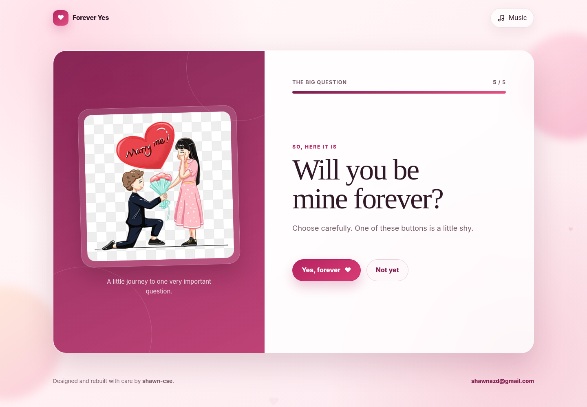
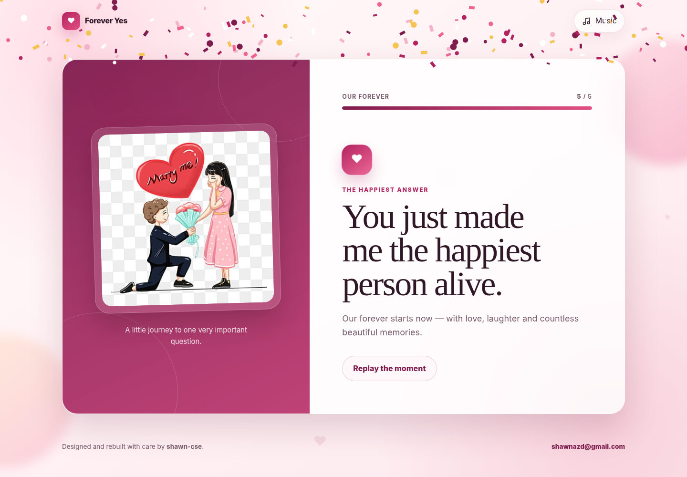
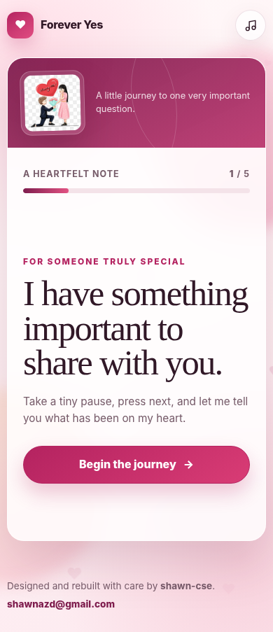

# Forever Yes

A polished, responsive and playful love-proposal website rebuilt from the original static project. It presents heartfelt messages step by step, includes background music, a playful moving “Not yet” button and a confetti celebration after the proposal is accepted.


## Project name

**Forever Yes** is simple, easy to understand and directly reflects the purpose of the experience: asking someone to choose a shared forever.

## Features

- Elegant split-card design with romantic imagery
- Five-step guided proposal flow with progress indicator
- Responsive layout for desktop, tablet and mobile
- Playful moving “Not yet” button with safe screen boundaries
- Animated confetti celebration rendered with Canvas
- Background music with an accessible play/pause control
- Floating decorative hearts and soft ambient background effects
- Keyboard navigation using the right-arrow key
- Reduced-motion support for accessibility
- Semantic HTML, ARIA labels and strong keyboard focus states
- No build process or paid hosting required
- Ready for GitHub Pages

## Technology

- HTML5
- Modern CSS3
- Vanilla JavaScript (ES6+)
- Canvas API
- Google Fonts with local system-font fallbacks

## Folder structure

```text
forever-yes/
├── assets/
│   ├── audio/
│   │   └── bg-music.mp3
│   └── images/
│       └── proposal.jpg
├── css/
│   └── style.css
├── js/
│   ├── app.js
│   └── confetti.js
├── screenshots/
│   ├── home-desktop.png
│   ├── proposal-desktop.png
│   ├── success-desktop.png
│   └── home-mobile.png
├── .gitignore
├── LICENSE
├── index.html
└── README.md
```

## Run locally

### Option 1: Open directly

Double-click `index.html` to open it in a browser. Most features will work immediately. Some browsers apply stricter rules to audio when opening local files, so using a local server is recommended.

### Option 2: VS Code Live Server

1. Install [Visual Studio Code](https://code.visualstudio.com/).
2. Install the **Live Server** extension.
3. Open the `forever-yes` folder in VS Code.
4. Right-click `index.html`.
5. Select **Open with Live Server**.

### Option 3: Python local server

Open a terminal inside the project folder and run:

```bash
python -m http.server 5500
```

Then open:

```text
http://localhost:5500
```

On Windows, use `py -m http.server 5500` when the `python` command is unavailable.

### Option 4: Node.js local server

```bash
npx serve .
```

Open the local address shown in the terminal.

## Customise the content

Open `index.html` and edit the text inside each `.slide` article.

Key sections:

- Intro message: first `.slide`
- Compliments: second, third and fourth `.slide`
- Proposal question: `.proposal-slide`
- Celebration message: `.success-slide`

Replace the illustration at:

```text
assets/images/proposal.jpg
```

Replace the music file at:

```text
assets/audio/bg-music.mp3
```

Keep the same file names, or update the corresponding paths in `index.html`.

## Change colours and fonts

The main design tokens are at the beginning of `css/style.css`:

```css
:root {
  --primary: #b42360;
  --primary-dark: #7f1d4e;
  --primary-soft: #ffe4ec;
  --ink: #311827;
  --muted: #765b69;
}
```

The project uses **DM Serif Display** for headings and **Manrope** for interface text, with fallback fonts for reliability.

## Deploy to GitHub Pages

1. Sign in to GitHub using the account `shawn-cse`.
2. Create a new repository, for example `forever-yes`.
3. Upload all project files to the repository root.
4. Open the repository **Settings**.
5. Select **Pages** from the sidebar.
6. Under **Build and deployment**, choose **Deploy from a branch**.
7. Select the `main` branch and `/ (root)` folder.
8. Click **Save**.
9. Wait a few minutes for GitHub to publish the site.

The public URL should follow this format:

```text
https://shawn-cse.github.io/forever-yes/
```

## Git commands

```bash
git init
git add .
git commit -m "Build Forever Yes proposal website"
git branch -M main
git remote add origin https://github.com/shawn-cse/forever-yes.git
git push -u origin main
```

Create the GitHub repository before running the final two commands.

## Browser support

The website is designed for current versions of Chrome, Edge, Firefox and Safari. Background music begins only after a user presses the music button because modern browsers block unrequested autoplay.

## Accessibility notes

- All controls are keyboard accessible.
- A skip link is available for keyboard users.
- The progress indicator includes ARIA values.
- Motion is reduced when the operating system requests reduced animation.
- Decorative animations are hidden from screen readers.
- The moving “Not yet” effect is pointer-based; keyboard users can still use the interface safely.

## Screenshots

### Desktop home


### Desktop proposal



### Desktop success state



### Mobile home



## Author

- GitHub: [shawn-cse](https://github.com/shawn-cse)
- Email: [shawnazd@gmail.com](mailto:shawnazd@gmail.com)

## Licence

This project is available under the MIT Licence. See `LICENSE` for details.
