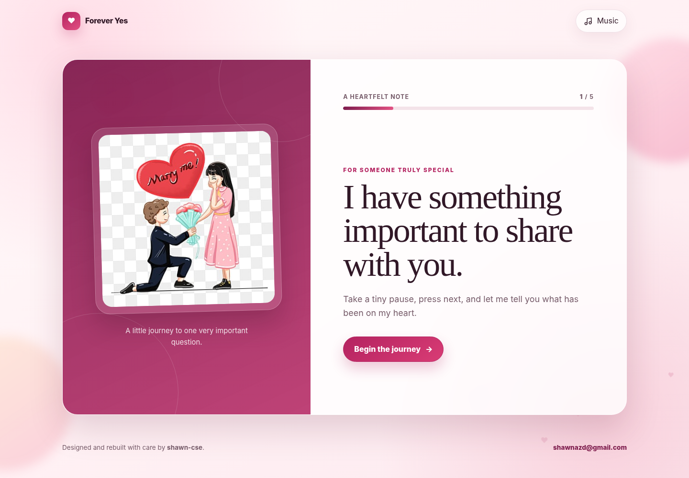

# Forever Yes

**Forever Yes** is a polished, responsive and playful love-proposal website built with HTML, CSS and vanilla JavaScript. The experience stays inside a compact single-screen card on normal desktop and mobile displays, so the visitor does not have to keep scrolling through the proposal.



## What was improved

- Compact viewport-based layout with dramatically less scrolling
- Better spacing on desktop, tablet and mobile
- Fixed proposal action section so the **Yes** and **Not yet** buttons never overlap or get clipped
- Dedicated safe movement area for the playful **Not yet** button
- Softer button scaling so the **Yes** button stays aligned
- English song playback instead of the previous local background audio
- Music begins after the first real interaction, which works with modern browser autoplay rules
- Lower background volume for a cleaner experience
- Responsive typography and shorter vertical spacing
- Five-step proposal journey with progress indicator
- Canvas confetti celebration
- Floating hearts and ambient background effects
- Keyboard navigation and accessible controls
- GitHub Pages ready — no framework or build process required

## Technology

- HTML5
- Modern CSS3
- Vanilla JavaScript (ES6+)
- Canvas API
- Google Fonts with system-font fallbacks

## Folder structure

```text
forever-yes/
├── assets/
│   ├── audio/
│   │   └── README.md
│   └── images/
│       └── proposal.jpg
├── css/
│   └── style.css
├── js/
│   ├── app.js
│   └── confetti.js
├── screenshots/
│   ├── home-desktop.png
│   ├── proposal-desktop.png
│   ├── success-desktop.png
│   └── home-mobile.png
├── .gitignore
├── LICENSE
├── MEDIA-LICENSE.md
├── index.html
└── README.md
```

## Music

The default soundtrack is the English chorus **“Every Little Movement”**. The recording is loaded from Wikimedia Commons and is published under **CC0 / public domain dedication**.

The music is intentionally loaded from the public source instead of being bundled as a copyrighted commercial song inside the repository.

### Use your own English song

If you have an MP3 you are legally allowed to use, place it inside:

```text
assets/audio/
```

For example:

```text
assets/audio/my-song.mp3
```

Then replace the `<audio>` element in `index.html` with:

```html
<audio id="backgroundMusic" loop preload="metadata">
  <source src="assets/audio/my-song.mp3" type="audio/mpeg" />
</audio>
```

You do not need to change the JavaScript.

## Run locally

### Option 1 — VS Code Live Server

1. Open the `forever-yes` folder in Visual Studio Code.
2. Install the **Live Server** extension if needed.
3. Right-click `index.html`.
4. Select **Open with Live Server**.

### Option 2 — Python

Inside the project folder run:

```bash
python -m http.server 5500
```

On Windows, if `python` is unavailable:

```bash
py -m http.server 5500
```

Then visit:

```text
http://localhost:5500
```

### Option 3 — Node.js

```bash
npx serve .
```

Open the local address shown in the terminal.

## Customise the proposal text

Open `index.html` and edit the text inside the `.slide` elements.

Main sections:

- First slide — opening message
- Second slide — first compliment
- Third slide — second compliment
- Fourth slide — final message before the question
- `.proposal-slide` — main proposal question
- `.success-slide` — celebration message

## Replace the proposal image

Replace:

```text
assets/images/proposal.jpg
```

For best results use a square or nearly square image. Keeping the same filename means no code changes are required.

## Change colours

The main design variables are at the beginning of `css/style.css`:

```css
:root {
  --primary: #b42360;
  --primary-dark: #7f1d4e;
  --primary-soft: #ffe4ec;
  --ink: #311827;
  --muted: #765b69;
}
```

## Responsive behaviour

The layout is designed to avoid unnecessary scrolling:

- Desktop: image and proposal content stay side by side inside a bounded card.
- Tablet: the image becomes a compact banner above the content.
- Mobile: the image banner becomes smaller and the footer is removed from the main viewport.
- Short desktop screens: typography and image size automatically compress.

The **Not yet** button is restricted to its own movement area, so it cannot cover the **Yes** button or escape outside the proposal card.

## Deploy to GitHub Pages

1. Sign in to GitHub with `shawn-cse`.
2. Create a repository named `forever-yes`.
3. Upload the project files to the repository root.
4. Open **Settings → Pages**.
5. Under **Build and deployment**, choose **Deploy from a branch**.
6. Select the `main` branch and `/ (root)`.
7. Save the settings.
8. Wait for GitHub Pages to publish the project.

Your site should then be available at:

```text
https://shawn-cse.github.io/forever-yes/
```

## Git commands

```bash
git init
git add .
git commit -m "Build Forever Yes proposal website"
git branch -M main
git remote add origin https://github.com/shawn-cse/forever-yes.git
git push -u origin main
```

Create the GitHub repository before running the final two commands.

## Browser notes

Modern browsers normally block audio that starts before a user interaction. Forever Yes starts the song when the visitor begins the proposal journey, so it follows normal browser playback restrictions.

If a network blocks Wikimedia Commons, the rest of the website still works normally; only the default song will be unavailable. You can bundle your own permitted MP3 using the instructions above.

## Accessibility

- Semantic buttons and headings
- Keyboard focus styles
- Right-arrow navigation through the message slides
- ARIA progress information
- Reduced-motion support
- Decorative animations hidden from screen readers
- No-button movement is contained inside a dedicated safe area

## Author

- GitHub: [shawn-cse](https://github.com/shawn-cse)
- Email: [shawnazd@gmail.com](mailto:shawnazd@gmail.com)

## Licence

The website source code is available under the MIT Licence. See `LICENSE` for details.

The default music has its own public-domain/CC0 status documented in `MEDIA-LICENSE.md`.
